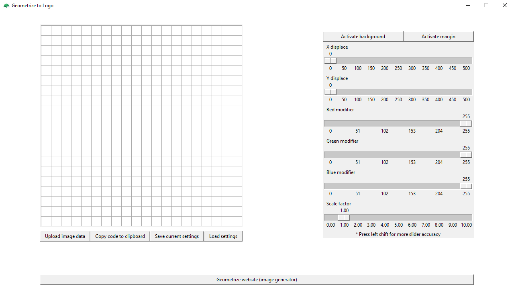

# Geometrize-to-logo
[](https://github.com/Flaks45/Geometrize-to-logo/)

Python tkinter application to turn [Geometrize](https://www.samcodes.co.uk/project/geometrize-haxe-web/)'s renders into Logo code following a limited subset of [Berkeley Logo Reference Manual](https://people.eecs.berkeley.edu/~bh/v2ch14/manual.html)'s Logo formatting.

# Installation
#### Python 3.9 or higher is required
To install the dependencies for this project run the following command:
```bash
# Linux/macOS
python3 -m pip install -r requirements.txt

# Windows
py -3 -m pip install -r requirements.txt
```

# Usage
To execute the main functionality of the project run **main.py**



From here, click on **Geometrize website** button and input the following settings to get an image to work with:


You could technically remove certain shape types selected in here and change the *random shapes per step* and *shape mutation per step*, but **DO NOT CHANGE *shape opacity* AND DO NOT ADD OTHER TYPES OF SHAPES**, the application won't be able to load it properly (as this limited Logo's subset doesn't allow for opacity or a fast way of generating polygons).

Inside the website load your image with "Open Image" and once it's finished click on "Save Json" to get the Geometrize JSON file.

### Upload image data
You can use the JSON file obtained from Geometrize with this button, get the file path and open it. Your image should pop up.

### Copy code to clipboard
This button will generate the Logo code from the image above. It should run as it is displayed.

### Save current settings / Load settings
You can save the current settings as another JSON file. **This one will contain your geometrized image data**, but you can choose to not import it and just use the configuration attached with another Geometrized image. 

### Other
Every other button just modifies the Geometrized image. You have a few examples under [Examples](Examples/)
